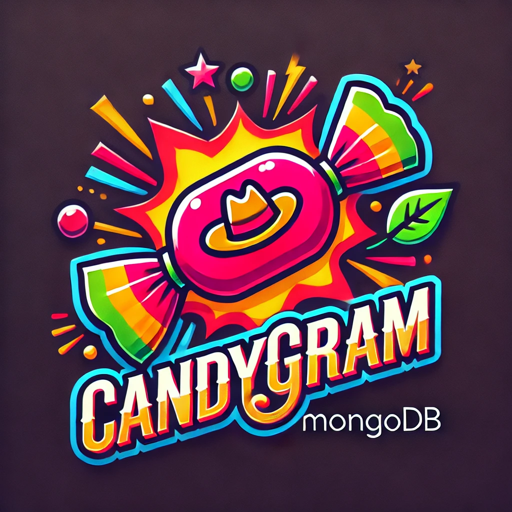

# **Candygram**



**Candygram: A lightweight MongoDB management tool for exploring, querying, and managing your database.**

---

## **Features**

- **Explore MongoDB Databases**: Navigate through collections, view documents, and manage database structures.
- **Query Builder**: Build, execute, and save queries with ease.
- **Data Visualization**: View and interact with MongoDB data in a user-friendly interface.
- **Clipboard Integration**: Automatically fetch and search for MongoDB ObjectIds copied to your clipboard.
- **Offline Ready**: Works without internet access when connected to local MongoDB instances.
- **Cross-Platform**: Runs seamlessly on Windows, macOS, and Linux.

---

## **Technologies Used**

- **[Neutralino.js](https://neutralino.js.org)**: A lightweight framework for cross-platform desktop applications.
- **[MongoDB](https://www.mongodb.com)**: For database operations.
- **[TailwindCSS](https://tailwindcss.com)**: For styling the application.
- **JavaScript**: For app logic and interactions.

---

## **Getting Started**

### **Requirements**

1. **MongoDB**: Ensure you have a running MongoDB instance (local or remote).
2. **Node.js**: Required for building the application (if running in development mode).

---

### **Installation**

1. Download the appropriate build for your operating system from the [Releases](#) page.
2. Extract the files.
3. Run the executable:
   - **Windows**: `candygram-win_x64.exe`
   - **macOS**: `candygram-mac_x64`
   - **Linux**: `./candygram-linux_x64`

---

## **Running the App in Development Mode**

1. Clone the repository:

   ```bash
   git clone https://github.com/your-repo/candygram.git
   cd candygram
   ```

2. Install Neutralino CLI:

   ```bash
   npm install -g @neutralinojs/neu
   ```

3. Run the app:
   ```bash
   neu run
   ```

---

## **Building for Distribution**

1. Ensure the latest Neutralino CLI is installed:

   ```bash
   npm install -g @neutralinojs/neu
   ```

2. Build the app:

   ```bash
   neu build
   ```

3. The build output will be in the `dist/` directory:
   ```
   dist/
   ├── candygram-linux_x64
   ├── candygram-mac_x64
   ├── candygram-win_x64.exe
   └── resources.neu
   ```

---

## **Directory Structure**

```plaintext
candygram/
├── LICENSE               # License file
├── README.md             # Project documentation
├── bin/                  # Neutralino.js binaries
├── dist/                 # Output of built executables
├── neutralino.config.json # App configuration
├── resources/            # All app resources
│   ├── index.html        # Main HTML file
│   ├── app.js            # Clipboard and app logic
│   ├── assets/
│   │   └── css/
│   │       └── tailwind.css # TailwindCSS styles
│   ├── js/
│   │   ├── main.js       # App entry point
│   │   └── neutralino.js
│   └── icons/
│       ├── appIcon.png   # App icon
```

---

## **Licensing**

Candygram is available under a **dual-license model**:

### **1. GNU General Public License v3 (GPLv3)**

- This software is free to use, modify, and distribute under the GPLv3.
- If you distribute this software, you must release your source code under the GPLv3.

See the [LICENSE](./LICENSE) file for the full terms.

### **2. Commercial License**

- For proprietary use, you can purchase a commercial license.
- This license allows you to use Candygram in closed-source projects without the restrictions of the GPL.

Contact [your-email@example.com](mailto:your-email@example.com) for commercial licensing details.

---

## **Contributing**

We welcome contributions! Please follow these steps:

1. Fork the repository.
2. Create a new branch:
   ```bash
   git checkout -b feature-name
   ```
3. Commit your changes:
   ```bash
   git commit -m "Add feature: description"
   ```
4. Push your branch and open a pull request.

---

## **Support**

If you encounter any issues or have questions, feel free to:

- Open an issue on [GitHub](#).
- Contact us at [your-email@example.com](mailto:your-email@example.com).

---

## **Acknowledgments**

- MongoDB for its powerful database platform.
- Neutralino.js for its lightweight and efficient framework.
- TailwindCSS for its modern and intuitive styling tools.
